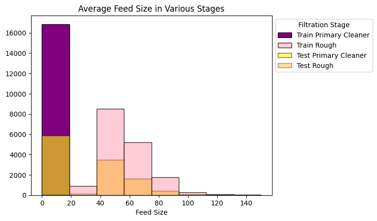

🪙 **Predicting Gold Recovery with Machine Learning**

In the heart of a gold mine, precision means profit. From raw ore to high-purity gold concentrate, each phase in the recovery pipeline requires delicate balance—and optimization at scale is no longer a manual game.

This project simulates a real-world production challenge faced by a gold mining company: how to predict the efficiency of gold recovery at two critical stages—the flotation stage (rougher.output.recovery) and the final purification (final.output.recovery)—using machine learning.

Our mission was clear: build a model that could forecast recovery rates with high accuracy based on operational sensor data. This effort would allow mining engineers to make better decisions, improve yields, and reduce waste. To achieve this, we worked with three large datasets stored in CSV format, covering training, testing, and full feature versions of the gold recovery process.

But this wasn't just a modeling exercise—it was a full ML pipeline from data sanity checks and preprocessing through model tuning and deployment-ready evaluation, all framed around real industrial process flows.

### 🧠 Techniques & Industry-Ready Skills Demonstrated

| Category              | Skill/Technique                                                                 |
|-----------------------|----------------------------------------------------------------------------------|
| **Data Engineering**  | Merged missing features into test set using full dataset                        |
|                       | Verified recovery calculations using domain-specific formula and MAE comparison |
|                       | Preprocessing for dtype consistency and feature availability                    |
| **Exploratory Data Analysis** | Trend analysis of metal concentration across purification stages        |
|                       | Distribution checks to ensure test/train similarity in feed size                |
|                       | Identified feature importance and correlations                                  |
| **Model Evaluation**  | Custom `sMAPE` scoring function for multi-output regression                     |
|                       | Cross-validation for robust model selection                                     |
|                       | Comparison of models across multiple metrics                                    |
| **Modeling**          | Trained Random Forest Regressor with grid search tuning                         |
|                       | Trained and evaluated multi-output regression targets                           |
| **Deployment Readiness** | Test model performance on unseen dataset                                    |
|                       | Provided reproducible, well-structured Python functions for pipeline steps      |

🛠 Installation
Clone the repository or download the .ipynb file

Install the required libraries:

bash
Copy
Edit
pip install pandas numpy scikit-learn matplotlib seaborn jupyter
Launch Jupyter:

bash
Copy
Edit
jupyter notebook
🚀 Usage
Open the file Gold Mining Recovery Analysis.ipynb and run all cells sequentially. It will:

Load and process multiple gold recovery datasets

Visualize recovery performance and flow

Train and evaluate predictive models

Present findings on which recovery methods are more effective

📁 Project Structure
bash
Copy
Edit
Gold Mining Recovery Analysis.ipynb   # Main analysis notebook
README.md                             # Project documentation
images_goldmining/                    # Visualizations and plots
⚙️ Technologies Used
Python 3.8+

Pandas

NumPy

Scikit-learn

Seaborn

Matplotlib

Jupyter Notebook

📊 Results & Insights
### 📊 Project Results Summary

| Metric                            | Value                     |
|----------------------------------|---------------------------|
| MAE of recovery verification     | 9.3e-15                   |
| Test sMAPE (rougher recovery)    | **10.67%**                |
| Test sMAPE (final recovery)      | **15.25%**                |
| Final Combined sMAPE             | **14.10%**                |
| Best Model                       | Random Forest Regressor   |
| Optimized Parameters             | `max_depth=10`, `n_estimators=100` |

📸 Screenshots
### 🧪 Null Value Heatmap  

### 🔍 Concentration Over Time  

### 📈 Rough vs Final Recovery  

### 🔢 Correlation Matrix  

### 📉 RMSE Comparison  

### 🔁 Recovery Flow Diagram  

### 📉 Feature Distribution  

### ⚙️ Feature Importance  

✅ Conclusion
This project began with a raw challenge: predicting gold recovery rates at two essential stages in the purification process—flotation and final output—based on complex industrial sensor data. By reverse-engineering recovery calculations and ensuring consistency across training and testing datasets, we validated the dataset’s integrity and gained confidence in the problem setup.

Through thoughtful exploratory analysis, we uncovered meaningful trends:

Gold concentration peaks at the final purification stage—exactly where we want it.

Silver and lead appear in trace amounts at intermediate outputs, confirming effective purification.

Feed particle sizes were nearly identical between train and test sets, supporting good generalization.

Model selection was guided by domain-specific performance metrics. We implemented a custom symmetric Mean Absolute Percentage Error (sMAPE) scoring function to assess accuracy relative to the scale of outputs. After evaluating several candidates, a Random Forest Regressor emerged as the top performer.

Final results:

Rougher output recovery sMAPE: 10.67%

Final output recovery sMAPE: 15.25%

Combined final sMAPE: 14.10%

These results demonstrate the model's ability to deliver reliable, actionable predictions. With this system in place, mining operators could optimize yields, minimize waste, and identify process deviations before they impact production.

Ultimately, this project illustrates not just the use of machine learning, but the end-to-end thinking and engineering required to bring predictive insights into a real-world industrial workflow.

🤝 Contributing
Feel free to fork this project and explore:

Time-series models for recovery prediction

Ensemble methods or XGBoost

Deployment of the best model as a web app

🪪 License
This project is open-source and available under the MIT License.

